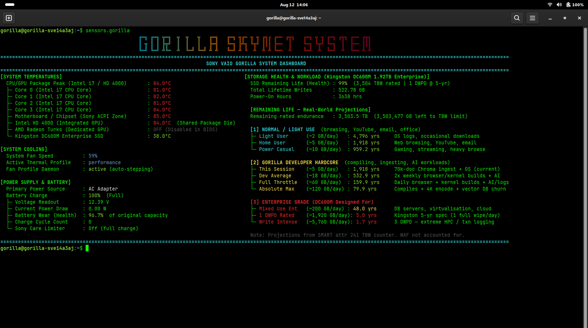

<!-- Version: 2.2.0 · updated 26-08-13-20-13 -->
# sensors.gorilla 🦍

<!-- WHO-THIS-IS-FOR: managed block, do not edit by hand -->

**One live terminal readout of every hardware sensor your laptop will admit to, with nothing to install.**

Built for the people every other tool prices out: kids with no credit
card, 15-year-old laptops, data sold by the megabyte. Free forever, by
design, not as a trial.
Why, with the numbers: [PHILOSOPHY.md](https://github.com/gorillanobakaa-dot/Gorilla.Opencode/blob/main/PHILOSOPHY.md)

<!-- /WHO-THIS-IS-FOR -->

> *A zero-dependency Python 3 terminal dashboard that maps every readable
> hardware sensor on a Sony VAIO SVE14A3AJ — and any similar Linux machine —
> into one live, colour-coded readout that follows the window as you resize it.*

[](dashboard.png)

*v2.0.0 in a 176-column terminal. Click for full resolution. The footer reports
the live column count, so you can see the layout tracking the window.*

---

## 🧸 Section A — For the Layman

### What does this do?

Imagine your laptop had a health panel — like a car dashboard — that told you everything happening inside it in real time: how hot the CPU is, how the fan is coping, how healthy the battery still is, how much life your SSD has left, and how long it will last under different usage styles.

That is exactly what `sensors.gorilla` is.

Run one command in the terminal and you get a full-screen dashboard showing:

- 🌡️ **Temperatures** — Every CPU core, the motherboard chipset, the integrated GPU, and the SSD drive
- 💨 **Fan speed** — What percentage the fan is running at right now
- 🔋 **Battery health** — Not just "how charged is it", but *how worn out is the battery itself* compared to when it was brand new (in %). Plus how many times it has been charged (cycle count)
- 💾 **SSD health and lifetime** — How much life the Kingston Enterprise SSD has left, displayed as years-to-go under realistic usage scenarios:
  - *"If you just browse the web and watch YouTube, this drive will last 1,918 years"*
  - *"If you compile Firefox from scratch every single day, it will last 160 years"*
  - *"If you run it at full enterprise blast (1 full overwrite per day as Kingston designed it for), it lasts 5 years"*

Across the top: a **Gorilla Skynet System** banner made of glowing letters in fire colours (cyan → orange → red) rendered entirely in text characters — no images, just Unicode. Below it the data is laid out in **two columns** — temperatures, cooling and power on the left, storage health on the right — so the whole dashboard fits a maximized window without scrolling.

It **follows the window**. Resize the terminal and the dashboard re-lays itself out straight away: two columns when there is room, two columns with the workload descriptions dropped when it is a little tight, and a single stacked column when it is genuinely narrow. Whenever it is not showing you the full layout it says so, and says what width it would need — so a cramped dashboard never looks like a broken one.

**Companion tool:** [`thermal-profile-daemon`](./thermal-profile-daemon.README.md) — a zero-dependency background service that automatically steps the Sony fan profile (silent/balanced/performance) with CPU temperature, since nothing else on Linux ever touches that knob. The dashboard's `[SYSTEM COOLING]` section shows whether it is running.

### How was it built?

All sensor data is read directly from Linux kernel files (`/sys` filesystem) — the same files the `sensors` command reads. The SSD data comes from the industry-standard `smartctl` tool that queries the drive's built-in health counters (called SMART attributes). No internet connection needed. No cloud. No tracking. Everything runs locally.

The SSD lifespan maths uses the drive manufacturer's (Kingston) official rated endurance of **3,504 Terabytes Written** and compares it to how many bytes have actually been written to the drive so far.

---

## 💻 Section B — For the Developer

### Requirements

- Python 3 (stdlib only — `glob`, `os`, `subprocess`, `re`, `time`, `argparse`)
- `smartmontools` (`sudo apt install smartmontools`) — for SMART attribute reads via `sudo smartctl -A /dev/sda`
- Linux kernel with `coretemp`, `acpitz`, `sony-laptop` modules loaded (standard on VAIO SVE14A3AJ)
- **Terminal width.** The layout degrades in steps rather than falling off a
  cliff, and says which step it is on. Measured on the reference machine:

  | Your terminal | What you get |
  |---|---|
  | 173 columns or more | Two columns, workload descriptions shown |
  | 158–172 | Two columns, descriptions hidden (it says so) |
  | 90–157 | Single stacked column (it says so, and why) |
  | under ~82 | The panels themselves are wider than the screen; nothing to be done |

### Resizing the window

A new terminal on Debian opens small, so the first run in a fresh window will
often stack. **Maximising afterwards will not reflow that output** — it is
already printed, and no program can reach back into your scrollback and rewrap
text it has already written. `ls` and `git log` behave the same way.

**Since 2.0 this is handled for you: the dashboard is live by default.**

```bash
sensors.gorilla           # live, follows the window
sensors.gorilla --once    # one snapshot then exit (the pre-2.0 behaviour)
sensors.gorilla -n 5      # refresh every 5 seconds
```

It listens for `SIGWINCH` — the signal the terminal sends the instant you
resize — and redraws immediately rather than waiting for the next tick.
Measured: with a 5-second refresh interval, a maximise redraws in **0.8s**. The
footer shows the current column count so you can see it tracking.

**Piping and redirection are unaffected.** When output is not a terminal it
always prints once and exits, so `sensors.gorilla > report.txt`, pipelines and
cron jobs behave exactly as before — a live default that hung a shell script
would be a worse bug than the one it fixed.

  Those numbers are computed at runtime, not hardcoded — they shift as panel
  content changes. Check your width with `tput cols`. A maximized terminal on a
  1600×900 screen is roughly 176 columns, which clears the full layout, but only
  just: earlier versions required 173 with no fallback in between, so a scrollbar
  or a slightly wider font silently cost you the second column.

### Installation

```bash
./recreate_success.sh
```

Installs to `~/.local/bin`, verifies the installed file matches the source, and
warns if that directory is not on your `PATH`. Two other modes:

```bash
./recreate_success.sh --link    # symlink instead of copy — for developing
./recreate_success.sh --check   # is what is installed still in sync?
```

`--link` exists because a copy drifts. Three copies of this script once ended up
on one machine at two different revisions, with the documentation describing a
third; the afternoon that cost is why `--check` exists at all.

### Usage

```bash
sensors.gorilla           # live dashboard, follows the window (the default)
sensors.gorilla --once    # one snapshot, then exit
sensors.gorilla -n 5      # live, refresh every 5 seconds
sensors.gorilla --version # version and the date it was last changed
```

**Live is the default since 2.0.** A printed snapshot cannot reflow when you
resize the terminal — the text is already in your scrollback — so the old
default left a stale single-column layout on screen after maximising, with no
way to fix it but re-running. The live view listens for `SIGWINCH` and re-lays
out immediately.

**Redirection and pipes are unaffected.** When output is not a terminal it always
prints once and exits, so `sensors.gorilla > report.txt`, shell pipelines and
cron jobs behave exactly as before. A live default that hung a script would be a
worse bug than the one it fixed.

### Versioning

Every file here carries its version and the time it last changed, in the header
and — for the script — on the dashboard itself:

```
SONY VAIO GORILLA SYSTEM DASHBOARD   v2.0.0 · 26-08-13-20-02
```

The script reads that stamp out of its own header at runtime rather than keeping
a separate constant, so the number on screen cannot drift from the file. A
version you can only see by opening the file does not tell you which build you
are looking at, which is the entire point of having one.

### Sensor Sources (Complete Map)

| Sensor | sysfs / tool path | SMART attr |
|---|---|---|
| CPU Package Peak | `/sys/.../coretemp/temp1_input` | — |
| CPU Core 0–3 | `/sys/.../coretemp/temp2–5_input` | — |
| Motherboard (acpitz) | `/sys/class/hwmon/hwmon1/temp1_input` | — |
| Intel HD 4000 | Shared CPU package die | — |
| AMD Radeon Turks | `/sys/class/hwmon/hwmon*/name` (amdgpu scan) | — |
| SSD Temperature | `smartctl -A /dev/sda` | attr 194 RAW |
| SSD Health | `smartctl -A /dev/sda` | attr 231 VALUE |
| SSD Lifetime Writes | `smartctl -A /dev/sda` | attr 241 RAW × 32 MB |
| SSD Power-On Hours | `smartctl -A /dev/sda` | attr 9 RAW |
| CPU Package Power | `/sys/class/powercap/intel-rapl:0/energy_uj` (2 samples ÷ Δt, via sudo) | — |
| CPU cores / uncore Power | `intel-rapl:0:0` + `intel-rapl:0:1` energy counters | — |
| CPU Frequency | max of `/sys/devices/system/cpu/cpu*/cpufreq/scaling_cur_freq` | — |
| Intel GPU Frequency | `/sys/class/drm/card*/gt_cur_freq_mhz` (+ `gt_max_`) | — |
| Thermal Throttle Events | `/sys/devices/system/cpu/cpu*/thermal_throttle/*` | — |
| Fan Speed | `/sys/devices/platform/sony-laptop/fanspeed` | — |
| Thermal Profile | `/sys/devices/platform/sony-laptop/thermal_control` | — |
| AC Online | `/sys/class/power_supply/ADP1/online` | — |
| Battery Charge % | `/sys/class/power_supply/BAT0/capacity` | — |
| Battery Status | `/sys/class/power_supply/BAT0/status` | — |
| Battery Voltage | `/sys/class/hwmon/hwmon2/in0_input` ÷ 1000 | — |
| Power Draw | `/sys/class/hwmon/hwmon2/power1_input` ÷ 1,000,000 | — |
| Battery Wear | `BAT0/energy_full` ÷ `BAT0/energy_full_design` | — |
| Cycle Count | `/sys/class/power_supply/BAT0/cycle_count` | — |
| Sony Care Limiter | `/sys/devices/platform/sony-laptop/battery_care_limiter` | — |
| Sony Care Health | `/sys/devices/platform/sony-laptop/battery_care_health` | — |

### SSD Lifespan Calculation

```python
TBW_TOTAL_GB = 3_504_000.0          # Kingston DC600M 1.92TB rated endurance
written_gb   = attr_241_raw * 32 / 1024
remaining_gb = TBW_TOTAL_GB - written_gb
years        = remaining_gb / gb_per_day / 365.25
```

Rendered across 10 profiles in 3 categories (Normal / Developer Hardcore / Enterprise).

### Logo Architecture

```
get_skynet_logo_lines()
  └── _LOGO_RAW[]           — 3 hand-crafted thin box-drawing strings (one banner row)
  └── _fire_colour(x, w)    — maps column position → (R, G, B) on cyan→orange→red arc
  └── \033[1;38;2;R;G;Bm    — true-colour bold ANSI per character
```

Banner is 79 columns wide, centred over the dashboard — the width is measured at runtime (`logo_w`), never assumed. No PIL. No pyfiglet. No external dependencies.

### Architecture Overview

```
sensors.gorilla
├── get_file_val()          — safe sysfs file reader with scale + default
├── get_cpu_temps()         — coretemp hwmon scanner
├── get_amd_gpu_temp()      — hwmon name-scan for amdgpu/radeon
├── get_battery_health()    — BAT0 + sony-laptop sysfs
├── get_ssd_metrics()       — smartctl subprocess parser
├── _fire_colour(x, width)  — gradient math
├── get_skynet_logo_lines() — ANSI-painted logo renderer
├── _two_columns()          — ANSI-aware two-column zip (width-adaptive)
└── build_dashboard()       — banner + two-column assembly, stacked fallback
```

### Changelog

**2.0.0 — 2026-08-13**

- **Live by default.** A printed snapshot cannot reflow on resize, so the
  default that left a stale layout on screen was the wrong one. `--once`
  restores the old behaviour. Non-tty output still prints once and exits.
- **Follows the window.** Watch mode listens for `SIGWINCH` and redraws
  immediately instead of waiting for the next tick. Measured: a maximise
  redraws in 0.8s with a 5-second refresh interval. The wait is a `select()`
  on a self-pipe, not `time.sleep()` — since PEP 475 a bare sleep is *resumed*
  after a signal rather than returning, so the redraw would still have been
  late.
- **Layout degrades in steps, not off a cliff.** It previously needed 173
  columns with nothing in between; a maximised terminal on the reference
  1600×900 screen is 176, so it cleared that by three columns and any
  scrollbar or font change silently cost you the second column. It now drops
  the workload descriptions first (158 columns), and only then stacks.
- **It says which step it is on**, and what width the next one needs. Silent
  degradation is what made a narrow terminal look like an old build.
- **Version on the dashboard**, read from the file's own header stamp at
  runtime. Plus `--version`.
- **Installer verifies the artifact** and gained `--link` and `--check`, because
  copies drift.

### Notes

- AMD Radeon Turks is disabled in BIOS on this machine → cleanly shows `OFF (Disabled in BIOS)`
- Intel HD 4000 temperature = CPU Package Peak (shared die, no separate sensor)
- `BAT0/cycle_count` may return `0` on some VAIO BIOSes (counter not exposed by ACPI)
- SSD lifespan projections do not account for Write Amplification Factor (WAF ≈ 1.5–3×)
- `sudo` is required for `smartctl` — script will show `N/A` if permission denied
- `sudo` is also required for RAPL power (`energy_uj` is root-only since kernel 5.10); shows `N/A` without it
- RAPL wattage is measured over a 0.25 s sample window, adding ~0.5 s to each render
- The board has no other sensor silicon: DMI declares zero temperature/current probes, the DDR3 SODIMMs carry no thermal sensor, and the Wi-Fi driver exposes no hwmon (verified with dmidecode/i2cdetect/lm-sensors, 2026-08-12)

---

*Built on a Sony VAIO SVE14A3AJ (Intel i7-3632QM, 16GB RAM, Kingston DC600M 1.92TB Enterprise SSD) running Debian Linux.*
